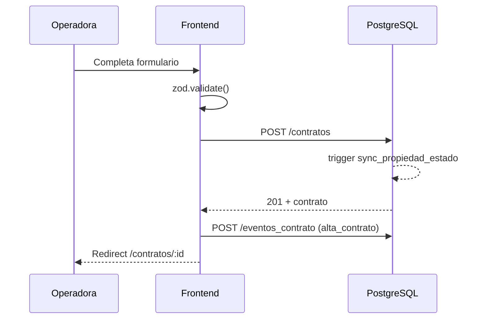

# Flujo 01 — Alta de contrato

**Pantallas:** `/nuevo-contrato` → `/contratos/:id`.

## Precondiciones
- Existe la **propiedad** (con `propietario_id` asignado).
- Existe el **inquilino** (persona con rol `inquilino`).
- Opcionalmente existe el **garante** (persona con rol `garante`).

## Pasos

1. Operadora abre `/nuevo-contrato`.
2. Selecciona propiedad. El sistema autocompleta `propietario_id` desde
   `propiedades.propietario_id`.
3. Selecciona inquilino (filtra `personas` por rol `inquilino`).
4. Define fechas, alquiler base, día de vencimiento.
5. Define **reglas comerciales** (quién paga TGI, API, expensas, seguro, servicios,
   expensas extraordinarias).
6. Define **comisión** (porcentaje + IVA si corresponde).
7. Define **ajuste** (`tipo_ajuste`, `frecuencia_ajuste`).
8. Submit ⇒ valida con zod ⇒ `POST /rest/v1/contratos`.
9. Trigger `sync_propiedad_estado` actualiza `propiedades.estado='Alquilada'` y setea
   `contrato_activo_id`.
10. Frontend registra evento `tipo='alta_contrato'` en `eventos_contrato`
    (`POST /rest/v1/eventos_contrato`).
11. Redirect a `/contratos/{id}`.

## Reglas y validaciones

- `fecha_inicio < fecha_fin`.
- No puede haber otro contrato `Activo` para la misma `propiedad_id` con rangos
  de fecha solapados.
- `comision_porcentaje` entre 0 y 30.
- `dia_vencimiento` entre 1 y 28 (evita meses cortos).

## Diagrama

