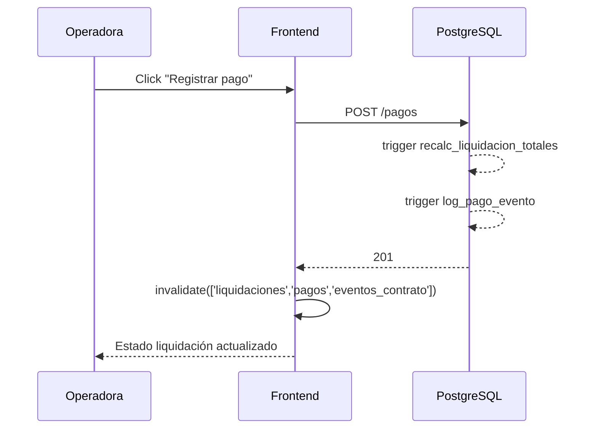

# Flujo 03 — Cobranza y pagos

**Pantallas:** `/liquidaciones/:id` → `RegistrarPagoDialog`, `/pagos`.

## Pasos

1. Operadora abre la liquidación.
2. Click en "Registrar pago" ⇒ `RegistrarPagoDialog`.
3. Completa fecha, monto, medio de pago, referencia.
4. `POST /pagos` con `estado='Confirmado'`.
5. **Triggers backend**:
   - `recalc_liquidacion_totales` recalcula `total_cobrado`, `pendiente` y `estado`
     (`Pendiente → Parcial → Cobrada`).
   - `log_pago_evento` agrega entrada `pago_registrado` en `eventos_contrato`.
6. React Query invalida `['liquidaciones']`, `['pagos']`, `['eventos_contrato']` ⇒
   UI se actualiza sin refresh.

## Reglas

- Un pago no puede ser mayor que `pendiente` salvo confirmación explícita.
- `Anular` un pago ⇒ `PATCH estado='Anulado'` ⇒ trigger revierte estado de la
  liquidación.
- Una liquidación en `Transferida` no puede recibir pagos nuevos sin antes
  revertir manualmente el estado.

## Diagrama

