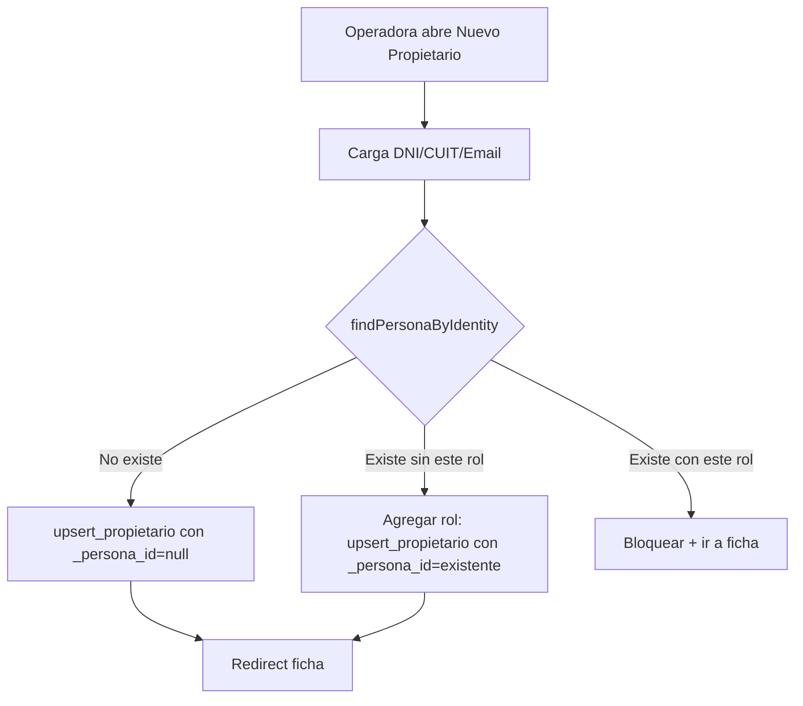

# Flujo 07 — Detección de duplicados al alta de personas

**Pantallas:** `/propietarios`, `/inquilinos` → `PersonaFormDialog`.

## Problema
Una persona puede ser **propietaria** de un inmueble e **inquilina** de otro al
mismo tiempo. Si se cargan dos veces, se rompen reportes, totalizadores y la
trazabilidad por persona.

## Solución
**Una sola tabla `personas`** con datos básicos, y dos tablas específicas
(`propietarios`, `inquilinos`) en relación 1-a-1. Antes de crear un nuevo
registro, el frontend busca duplicados por **DNI**, **CUIT** o **email** sobre
`personas`. Si la persona ya existe, se reutiliza su `persona_id` y se inserta
solo la fila del rol nuevo (vía `upsert_propietario` / `upsert_inquilino`).

> **Nota**: ya **no existe `personas_roles`**. Los roles de dominio se derivan
> de la existencia de filas en `propietarios` / `inquilinos`. Agregar un rol =
> insertar la fila correspondiente; quitarlo = borrarla.

## Pasos

1. Operadora hace click en "Nuevo propietario" (o inquilino).
2. Carga DNI / CUIT / email.
3. **onBlur** del último campo de identidad ⇒ ejecuta `findPersonaByIdentity`.
4. Si existe match:
   - Mostrar tarjeta con datos del existente.
   - Si **ya tiene el rol que estoy intentando cargar** ⇒ deshabilitar submit y
     ofrecer "Ir a la ficha".
   - Si **no tiene ese rol** ⇒ ofrecer botón "Agregar rol a esta persona"
     ⇒ ejecuta `upsert_propietario` / `upsert_inquilino` con el `persona_id`
     existente (no se crea persona nueva, solo la fila de rol).
5. Si no hay match ⇒ submit normal (`upsert_*` con `_persona_id = null`).

## Eliminación segura

Antes de eliminar:
- `GET /contratos?or=(propietario_id.eq.X,inquilino_id.eq.X)&estado=eq.Activo`
- `GET /propiedades?propietario_id=eq.X`

Si hay resultados ⇒ **bloquear** con modal explicativo listando los vínculos.
Si no hay ⇒ borrar la fila de `propietarios` / `inquilinos`. Si la persona no
queda referenciada en ninguna otra tabla de rol, el front elimina luego
`personas`.

## Diagrama

